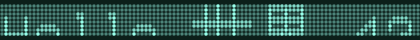
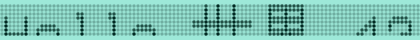
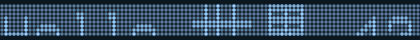
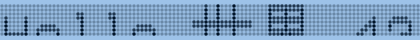
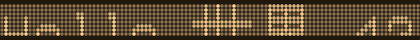
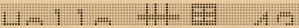

# EL Openglo — a desktop theme for people who reset a lot of watches

*Generated from one palette, solved once, emitted to every surface. This page is a projection of catalog/readme/readme.bib; do not edit it by hand.*

## What it is

EL Openglo is the look of a ZnS:Cu electroluminescent backlight — a near-black LCD panel, a blue-green phosphor glow near 505 nm, unlit "ghost" segments that stay faintly visible, and one deliberate inversion: selecting anything switches the backlight on, the way the whole panel lit while you held the button down, and the text on that lit selection clears the legibility floor in every variant[^LOOK].

Everything is generated: the palette is solved once and every emission target reads its colours from it, so no two surfaces can drift apart[^ONE-PALETTE].

Every generator actually runs and writes its artifact, in dependency order, rather than merely compiling[^RUNS].

## The six variants

Six variants ship: EL-Openglo (the blue-green phosphor), EL-Azure and EL-Amber (amber EL panels were real too), and the backlit form of each — EL-Openglo-Lit, EL-Azure-Lit and EL-Amber-Lit — where the panel is the lit backlight and the digits are dark; every separation pair the palette declares enforced clears the colour-vision-deficiency floor in all six[^SIX].

In every variant the three decoration states — focus ring, selection field, hover ring — stay pairwise distinguishable[^STATES].

## What it emits

The generator roster as `emitters.py` declares it — every module, its role, and for those run in order, what that step writes[^ROSTER].

| module | role | step |
| --- | --- | --- |
| make_palette | authority |  |
| make_preview | authority | owns parse_scheme; renders the previews |
| make_schemes | authority | writes the .colors files every other emitter reads |
| make_aurorae | emitter | window decoration, from GRID |
| make_chrome | emitter | browser manifests, from the scheme tokens |
| make_clock | emitter | the segment-clock plasmoid packages (plasma-clock/), from GRID |
| make_css | emitter | the palette as CSS custom properties, from GRID (W19) |
| make_firefox | emitter | Firefox theme manifests, Firefox's own key vocabulary (W15) |
| make_gtk | emitter | GTK4/libadwaita :root variables + GTK3 &#64;define-color (⊕GTK, rebuilt W17) |
| make_konsole | emitter | terminal scheme, from the scheme tokens |
| make_kvantum | emitter |  |
| make_notify_marquee | emitter |  |
| make_plasma | emitter | Plasma theme SVGs, from GRID |
| make_plymouth | emitter |  |
| make_sddm | emitter |  |
| make_taskswitch | emitter |  |
| make_union | emitter | Union styles: Breeze with its alphas solved, from the schemes (W14) |
| make_wallpaper | emitter | wallpaper; sources tokens with a standalone fallback |
| make_wallpaper_live | emitter |  |
| make_windows | emitter | Windows .theme per variant: wallpaper + accent + colour table (W16) |
| make_font | colourless | the segment and matrix fonts, TTF + SVG, from the substrate (⊕SEG-FONT family, rebuilt W24) |
| make_glyph_ink | colourless |  |
| make_inherit | colourless |  |
| make_segment_display | colourless |  |
| make_deb | packager |  |

`make_palette` solves the palette and `make_schemes` writes it as the Plasma/Qt `.colors` schemes, so the shipped schemes are solver output rather than a silent fallback's; `make_preview` owns `parse_scheme`, the token reader every other emitter shares, and renders the Global Theme previews[^SCHEMES].

`make_konsole` writes the Konsole scheme and profile, and every terminal format the theme ships — Konsole, Alacritty, foot, Windows Terminal, Termux — is a serialiser of one ANSI table[^TERMINAL].

`make_aurorae` writes the window decoration (the watch-case bezel) and `make_plasma` the Plasma desktop-theme SVGs; both run in the ordered roster and are staged into the install tree[^KDE-CHROME].

`make_kvantum` recolours the upstream KvFlat Kvantum theme through a mapper, plus the segmented `elprogress` progress-bar family[^KVANTUM].

`make_gtk` emits the palette as GTK4/libadwaita CSS variables and a GTK3 define-color sheet per variant, every name a documented libadwaita one and every background/foreground pair gated[^GTK].

`make_css` emits the palette as CSS custom properties, one block per variant, the plain and -Lit forms mapped onto prefers-color-scheme[^CSS].

`make_union` emits a KDE Union style per variant: Breeze imported, with its composited alphas solved from the scheme[^UNION].

`make_firefox` emits a Firefox WebExtension theme per variant in Firefox's own theme.colors vocabulary[^FIREFOX].

`make_chrome` emits a valid Chrome theme manifest (v3) for every declared variant, from the scheme tokens[^CHROME].

`make_windows` emits a Windows `.theme` per variant carrying the sections Microsoft's format requires: wallpaper, accent and colour table[^WINDOWS].

`make_taskswitch` emits one KWin window-switcher (Alt+Tab) package — lit selection, ghost rest, void ground, bound to the active scheme's roles — selected by the Look-and-Feel defaults[^TASKSWITCH].

`make_inherit` emits icon and cursor themes that draw nothing of their own: per variant they inherit Breeze (icons with FollowsColorScheme, cursors chosen by ground), selected by the Look-and-Feel defaults[^INHERIT].

`make_plymouth` writes the boot splash, whose digits are the segment substrate's own seven-segment projection rather than a parallel table[^PLYMOUTH].

`make_wallpaper` draws the static wallpaper as an SVG from the segment substrate, not a raster[^WALLPAPER].

`make_wallpaper_live` emits a live Plasma wallpaper package from its template, which the lock screen mounts too[^LIVE].

`make_notify_marquee` emits the notification ticker: one plasmoid whose dot-matrix board scrolls each notification, bound to the active scheme's roles[^MARQUEE].

`make_clock` emits the segment-clock plasmoid and `make_segment_display` the shared QML display it mounts; every segment surface renders from the one geometry substrate rather than carrying its own stroke table[^SEGMENTS].

`make_font` builds the segment and matrix fonts (TTF and SVG) natively from the substrate, and `make_glyph_ink` reads TTF outlines into ink fields for the glyph-matching research[^FONTS].

Every emitted QML document passes Qt's qmllint[^QML].

`make_deb` packages what the emitters produce, and every emitted package ships every component its QML instantiates[^PACKAGES].

## The palette

What each variant's scheme solves to, read from the emitted `.colors` files by `make_preview.parse_scheme` — the same reader every emitter uses[^PALETTE-TABLE].

| role | EL-Openglo | EL-Openglo-Lit | EL-Azure | EL-Azure-Lit | EL-Amber | EL-Amber-Lit |
| --- | --- | --- | --- | --- | --- | --- |
| ground | `#0c1f1a` | `#9de8d8` | `#0c161f` | `#9dc2e8` | `#1f170c` | `#e8c89d` |
| panel | `#0b1b17` | `#a1e9da` | `#0b131b` | `#a1c5e9` | `#1b140b` | `#e9caa1` |
| phosphor | `#99ffeb` | `#002921` | `#99ccff` | `#001429` | `#ffd499` | `#291800` |
| accent | `#4bfad7` | `#084c3f` | `#4ba2fa` | `#082a4c` | `#fab14b` | `#4c3008` |
| sel | `#06deb3` | `#0b6856` | `#1988f9` | `#0c3e71` | `#f29007` | `#6c440b` |
| window_fg | `#99ffeb` | `#002921` | `#99ccff` | `#001429` | `#ffd499` | `#291800` |
| focus | `#4bfad7` | `#084c3f` | `#4ba2fa` | `#082a4c` | `#fab14b` | `#4c3008` |
| view_bg | `#081411` | `#a9ebdd` | `#080e14` | `#a9caeb` | `#140f08` | `#ebcfa9` |
| sel_fg | `#081411` | `#a9ebdd` | `#080e14` | `#a9caeb` | `#140f08` | `#ebcfa9` |
| ghost | `#7ed3c3` | `#4c8176` | `#99cbfe` | `#425c75` | `#e5bf89` | `#7c6648` |

The palette is solved, not authored: every constraint is a declarative relation with a named quantity and a kind, derived from one edge authority and accepted by the symbolic solver[^RELATIONS].

The ghost is the solved balance point of its two sides — visible as shape, never readable as text — rather than the best of a sampled grid[^GHOST].

## Generating

The environment is uv-managed and `pyproject.toml` is the manifest: `uv sync` for the core emission path, `uv sync --extra research` for the font-ingest and glyph-matching pipeline, and every third-party import in the tree is accounted for there[^UV].

Each generator runs standalone from the repo root — `uv run python3 make_schemes.py` for the schemes, `uv run python3 make_preview.py` for the previews, `uv run python3 make_chrome.py` for the browser manifests — and the whole roster runs in order through `emitters.run_all`[^STANDALONE].

## Install

`overlay/` is a Gentoo Portage repository: its live ebuild `x11-themes/el-openglo-9999` installs through `make_deb.py --stage`, the same staging the Kubuntu `.deb` wraps, so the two package the same tree[^OVERLAY].

The install puts its commands in `/usr/bin`: `el-openglo-apply EL-Openglo` applies a variant for the current user, `el-openglo-sddm` selects the EL Openglo SDDM greeter theme by writing an `/etc/sddm.conf.d` drop-in (`Current=el-openglo-<slug>`; `--breeze` goes back, `--background` keeps the old background-only route), `el-openglo-plymouth EL-Openglo` the boot splash (as root), and `el-openglo-live` and `el-openglo-notify` place the live wallpaper and the notification ticker[^COMMANDS].

The SDDM background path ships as `el-openglo-sddm`[^SDDM].

Without a package, the colour scheme installs from System Settings → Colors & Themes → Colors → Install from File… (pick `EL-Openglo.colors`) or by copying it to `~/.local/share/color-schemes/`, and the Konsole scheme by copying `EL-Openglo.colorscheme` to `~/.local/share/konsole/` and choosing EL Openglo under Edit Current Profile → Appearance[^BY-HAND].

## The segment lattice

`segment_topology.py` holds one canonical geometry and derives the rest: 7, 9, 14, 16 and 22 segments, where the coarser formats are projections (mask and merge) of the 16-segment cell[^LATTICE].

22 is the odd one — not a coarsening but a superset: 16 plus six additions (two dots, one extra diagonal, three descender bars below the baseline), so lowercase letters with descenders resolve, and its consumers import that geometry from the module[^SEG22].

## What it can do

Every capability the design log (`COTYPE.md`) has closed and that names an artifact, each re-derived from the tree by its own witness on every run — `scripts/check_symbol.py <SYMBOL>` asks one[^CAPABILITIES].

| symbol | capability (as its witness states it) |
| --- | --- |
| ⊕APCA-CROSSCHECK | APCA is implemented and cross-checked (:3743) |
| ⊕APERTURE-FIELD | the matrix field is an aperture integral: ApertureField.qml grades every pip by a backdrop's coverage (prefix sums, no shader), the marquee paints its cells into that backdrop and scrolls by offset, the viewport is offsetY, and check_aperture holds the floor / halfway / lit relation on seen pixels (:7590) |
| ⊕BLOOM | every segment surface blooms by BLURRING a lit-only layer (MultiEffect, gated by config bloom), never the ghost (:2567) |
| ⊕CHROME-THEME | a valid Chrome manifest per variant from the scheme tokens (:2706) |
| ⊕CONTRAST-STRETCH | the lit stretch survives as cvd_gate.stretch_lit (:2487) |
| ⊕CURSOR-INHERIT | make_inherit.cursor_index: a cursor theme that inherits Breeze cursors by ground, selected by the LnF defaults \[kcminputrc\]\[Mouse\] (:2806) |
| ⊕DOT | the dot-matrix display component exists (:1002) |
| ⊕DOT-FONT | the matrix glyph table drives a font: matrix_contours over MatrixDisplay.glyph (:1068) |
| ⊕DOT-FONT-DESC | FONT5x8 with lowercase whose g j p q y descend below a declared baseline line, built into a TTF with negative descent (:1496) |
| ⊕DOT-FONT-TTF | one build_ttf over a contour source; build_matrix_ttf is a thin wrapper (:1425) |
| ⊕GHOST-DENSITY | check_ghost_composite.measure_formats gives the unlit field's cell coverage at 7/14/16/22 from the substrate geometry and measure_matrix the dot field's; --matrix reports both beside the stroke ghost per variant (:4459) |
| ⊕GLANCE-AUDIT | the glance audit runs each variant against its parsing-mode floor (:3652) |
| ⊕GTK | gtk/<id>/gtk{3,4}.css emit, every name a documented libadwaita one, values the palette's, bg/fg pairs gated (:683) |
| ⊕ICONS-INHERIT | make_inherit.icon_index: an icon theme that inherits breeze(-dark) with FollowsColorScheme, selected by the LnF defaults \[kdeglobals\]\[Icons\] (:2774) |
| ⊕KONSOLE | the Konsole scheme + profile emit and read back through the one ansi table (:2846) |
| ⊕KVT | the Kvantum recolour: a KvFlat mapper plus the elprogress family (KvFlat itself is EXTERNAL) (:612) |
| ⊕LOCKSCREEN | the lock screen mounts the live wallpaper (:3001) |
| ⊕MATRIX-FONT-INPUT | display_types.font_extension rasterises a build-time font (make_notify_marquee.matrix_font, the decision recorded) into the 5x8 table for Latin-1 beyond the authored glyphs; the board falls back to '?'; check_matrix_input measures (:4534) |
| ⊕NOTIFY-CAPABILITIES | the marquee reads urgency, transient, actions and job progress from the host's model (its contract measured by check_notify_roles), paints critical in the hot token and a job's history as a gauge, and a tap on an action run reaches invokeAction — catalog/notify-capabilities.md row by row (:7640) |
| ⊕NOTIFY-MARQUEE | a matrix-rendered notification ticker plasmoid per variant (:3542) |
| ⊕NOTIFY-MATRIXRENDER | the marquee draws its cells off the emitted registry's 5x8 display — since W54 as a backdrop behind an ApertureField — and check_display_registry round-trips that emission against the substrate (:4524) |
| ⊕NOTIFY-SEGRENDER | the ticker renders in the actual dot-matrix primitive (the field's round pips off the registry's 5x8 display), not monospace Text — the s65-corrected form (:3568) |
| ⊕ONE-THEME | every shipped QML surface (switcher, marquee, clock, live wallpaper) binds Kirigami.Theme's View roles instead of baked holes and ships as ONE package; legacy ids alias it and a one-shot update migrates a user's containments; the LnF stays the selector (catalog/one-theme.md) (:6603) |
| ⊕PANEL-LAYOUT | the LnF layout.js builds a bottom panel with kickoff, pager, icontasks, the system tray and the EL clock — richer than wallpaper+clock (:2785) |
| ⊕PARAMETRIC-PALETTE | the solver derives the scheme from the relations (:3894) |
| ⊕PLYMOUTH | the boot splash renders the substrate's digits per variant (:3331) |
| ⊕PLYMOUTH-VECTOR | the boot splash is drawn at the screen's size: the emitted .script scales the oversampled assets by Window.GetHeight and lays them out at the module pitch (:4228) |
| ⊕QML-SANITY | every staged .qml goes through Qt's qmllint, gated on error ids (:4318) |
| ⊕RENDER-GATE | make_deb renders the clock and live wallpaper headless and requires lit pixels (:4545) |
| ⊕SDDM | an SDDM greeter theme per variant (make_sddm -> /usr/share/sddm/themes/el-openglo-*, W66); the el-openglo-sddm Breeze-background helper is the secondary route (:3074) |
| ⊕SEG-DOTPRODUCT-TEMPLATES | glyph_match._arc_field bends the outer strokes to an arc; SAGITTA is solved by calibrate_projection --arcs (inward), and the round class is measured against it by --classes (:5204) |
| ⊕SEG-FONT | an SVG font whose glyphs are the union of the substrate's lit segments (:1252) |
| ⊕SEG-FONT-PROJECT | make_glyph_ink ingests native TTF outlines through fontTools and validate_projection runs over every authored key by default, the convention-gap glyphs pinned in KNOWN_CONVENTION (:4644) |
| ⊕SEG-FONT-TTF | TTFs built natively from glyph_contours via fontTools, orientation gated on glyf (:1366) |
| ⊕SEG-PROJECT-CALIBRATE | glyph_match.calibrate_projection solves frame x band by agreement over the authored table; SW_BAND is its argmax, not a hand-set 0.7 (:4631) |
| ⊕SEG-TABLE-VALIDATE | glyph_match.validate_projection cross-checks the projection against the authored table per glyph, and check_projection runs it and requires distinct projections (:4632) |
| ⊕SEG22 | the 22-seg geometry is the 16-seg lattice plus six additions (:1576) |
| ⊕SEG22-DESCENDERS | segment_topology.LETTERS22 (26 lowercase over SEG22, g j p q y on dl/dc/dr, DESCENDER_GLYPHS, glyph22) with its arms in the substrate selftest, validated at 22 by check_projection on the lowercase frame (:4455) |
| ⊕SOLVER-PERF | make_schemes._solved_grid solves the whole grid once and caches it under a content stamp over the solver's sources (.palette-cache.json), bypassed by EL_NO_PALETTE_CACHE (:4182) |
| ⊕SOLVER-UI-TOKENS | no RGB literal in solve_scheme's token dict, and the hover/selection states are solved by solve_state_steps, not authored nudges (:3928) |
| ⊕SPLASH | the LnF splash reads progress and the palette's ghost (:2910) |
| ⊕STROKE-WEIGHT | every segment surface draws the lit stroke thicker than the ghost stroke (T_lit/T_ghost > 1 at weight=1, read from the emitted QML) (:2646) |
| ⊕SUPERSAMPLE-WP | the wallpaper PNG is rasterised above its served resolution (cairosvg at 2560x1440 for a 1920x1080 wallpaper) from an SVG carrying a Gaussian glow filter — the two halves of the deferral (:2583) |
| ⊕TASKSWITCH | make_taskswitch emits ONE KWin/WindowSwitcher package (lit selection, ghost rest, void ground — the active scheme's roles since W35) selected by \[kwinrc\]\[TabBox\] LayoutName; policy/taskswitch.rego holds the structure, the id, the root, the lint and the bindings (:2787) |
| ⊕VER-CLOCK-TIME | the clock advances by a Timer (:2184) |
| ⊕VER-PREVIEW | the Global Theme previews render from the scheme (:1918) |
| ⊕VER-WIDGET-ICON | the plasmoid icon is a lit '12' over its ghost from the substrate (:2058) |
| ⊕WALLPAPER-LIVE | a Plasma/Wallpaper package per variant from the live template (:3440) |
| ⊕WALLPAPER-VECTOR | the wallpaper is an SVG from the substrate, not a raster (:4233) |

## What it looks like

Every surface in every variant, rendered through the theme engine itself — Qt under the KDE platform theme with that variant's scheme applied, not mock-ups — by `catalog/library/render_screens.py`; every still exists, is not blank and sits on its variant's ground, and every animation scrolls without tearing and loops seamlessly[^SCREENS].

Every picture the renderer declares, linked from its plan rather than by hand[^GALLERY].

<!-- paperkit:raw -->

### EL-Openglo

Stills: [clock-EL-Openglo](catalog/library/screens/clock-EL-Openglo.png), [switcher-EL-Openglo](catalog/library/screens/switcher-EL-Openglo.png), [live-wallpaper-EL-Openglo](catalog/library/screens/live-wallpaper-EL-Openglo.png), [marquee-EL-Openglo](catalog/library/screens/marquee-EL-Openglo.png), [marquee-paused-EL-Openglo](catalog/library/screens/marquee-paused-EL-Openglo.png), [pinholes-EL-Openglo](catalog/library/screens/pinholes-EL-Openglo.png).

### EL-Openglo-Lit

Stills: [clock-EL-Openglo-Lit](catalog/library/screens/clock-EL-Openglo-Lit.png), [switcher-EL-Openglo-Lit](catalog/library/screens/switcher-EL-Openglo-Lit.png), [live-wallpaper-EL-Openglo-Lit](catalog/library/screens/live-wallpaper-EL-Openglo-Lit.png), [marquee-EL-Openglo-Lit](catalog/library/screens/marquee-EL-Openglo-Lit.png), [marquee-paused-EL-Openglo-Lit](catalog/library/screens/marquee-paused-EL-Openglo-Lit.png), [pinholes-EL-Openglo-Lit](catalog/library/screens/pinholes-EL-Openglo-Lit.png).

### EL-Azure

Stills: [clock-EL-Azure](catalog/library/screens/clock-EL-Azure.png), [switcher-EL-Azure](catalog/library/screens/switcher-EL-Azure.png), [live-wallpaper-EL-Azure](catalog/library/screens/live-wallpaper-EL-Azure.png), [marquee-EL-Azure](catalog/library/screens/marquee-EL-Azure.png), [marquee-paused-EL-Azure](catalog/library/screens/marquee-paused-EL-Azure.png), [pinholes-EL-Azure](catalog/library/screens/pinholes-EL-Azure.png).

### EL-Azure-Lit

Stills: [clock-EL-Azure-Lit](catalog/library/screens/clock-EL-Azure-Lit.png), [switcher-EL-Azure-Lit](catalog/library/screens/switcher-EL-Azure-Lit.png), [live-wallpaper-EL-Azure-Lit](catalog/library/screens/live-wallpaper-EL-Azure-Lit.png), [marquee-EL-Azure-Lit](catalog/library/screens/marquee-EL-Azure-Lit.png), [marquee-paused-EL-Azure-Lit](catalog/library/screens/marquee-paused-EL-Azure-Lit.png), [pinholes-EL-Azure-Lit](catalog/library/screens/pinholes-EL-Azure-Lit.png).

### EL-Amber

Stills: [clock-EL-Amber](catalog/library/screens/clock-EL-Amber.png), [switcher-EL-Amber](catalog/library/screens/switcher-EL-Amber.png), [live-wallpaper-EL-Amber](catalog/library/screens/live-wallpaper-EL-Amber.png), [marquee-EL-Amber](catalog/library/screens/marquee-EL-Amber.png), [marquee-paused-EL-Amber](catalog/library/screens/marquee-paused-EL-Amber.png), [pinholes-EL-Amber](catalog/library/screens/pinholes-EL-Amber.png).

### EL-Amber-Lit

Stills: [clock-EL-Amber-Lit](catalog/library/screens/clock-EL-Amber-Lit.png), [switcher-EL-Amber-Lit](catalog/library/screens/switcher-EL-Amber-Lit.png), [live-wallpaper-EL-Amber-Lit](catalog/library/screens/live-wallpaper-EL-Amber-Lit.png), [marquee-EL-Amber-Lit](catalog/library/screens/marquee-EL-Amber-Lit.png), [marquee-paused-EL-Amber-Lit](catalog/library/screens/marquee-paused-EL-Amber-Lit.png), [pinholes-EL-Amber-Lit](catalog/library/screens/pinholes-EL-Amber-Lit.png).

Index: [README.md](catalog/library/screens/README.md).
<!-- /paperkit:raw -->

## Status

This repo is a recovery: the original was lost before it was ever pushed and the tree was replayed from session transcripts; `RECOVERY-NOTES.md` records what is trustworthy, and every file the archive marked partial is still recorded as partial[^RECOVERY].

What is checked rather than asserted lives in `catalog/worklist/` — a claim graph where every sentence carries a machine-checkable witness and an item is open exactly when its check fails; `python3 scripts/worklist_gate.py` runs it and `--project` regenerates its projections[^WORKLIST].

`COTYPE.md` is the design log — the reasoning behind every decision above — and it is read structurally, so its open work is computed rather than summarised[^COTYPE].

This page is itself one of those projections: `paper.toml` at the root and the claims in `catalog/readme/readme.bib`, and it names every emitter, variant, picture and closed capability the tree declares[^PROJECTION].

## Licence

Distributed under the GNU General Public License v3, as the Gentoo ebuild declares[^LICENCE].

[^LOOK]: Machine-verified — `check_selection_contrast.py`
[^ONE-PALETTE]: Machine-verified — `check_token_source.py`
[^RUNS]: Machine-verified — `check_emitters_run.py`
[^SIX]: Machine-verified — `check_separation.py` (grounded above in ONE PALETTE)
[^STATES]: Machine-verified — `check_states.py`
[^ROSTER]: Machine-verified — `opa_gate.py readme`
[^SCHEMES]: Machine-verified — `check_palette_chain.py`
[^TERMINAL]: Machine-verified — `check_terminals.py`
[^KDE-CHROME]: Machine-verified — `check_emitters_run.py` (grounded above in RUNS)
[^KVANTUM]: Machine-verified — `check_symbol.py KVT`
[^GTK]: Machine-verified — `check_gtk.py`
[^CSS]: Machine-verified — `check_css.py`
[^UNION]: Machine-verified — `check_union.py`
[^FIREFOX]: Machine-verified — `check_firefox.py`
[^CHROME]: Machine-verified — `check_chrome.py`
[^WINDOWS]: Machine-verified — `check_windows.py`
[^TASKSWITCH]: Machine-verified — `opa_gate.py taskswitch`
[^INHERIT]: Machine-verified — `check_inherit.py`
[^PLYMOUTH]: Machine-verified — `check_plymouth_digits.py`
[^WALLPAPER]: Machine-verified — `check_symbol.py WALLPAPER-VECTOR`
[^LIVE]: Machine-verified — `check_symbol.py WALLPAPER-LIVE`
[^MARQUEE]: Machine-verified — `opa_gate.py marquee_live`
[^SEGMENTS]: Machine-verified — `check_geometry_source.py`
[^FONTS]: Machine-verified — `check_font.py`
[^QML]: Machine-verified — `opa_gate.py qml_lint`
[^PACKAGES]: Machine-verified — `check_package_imports.py`
[^PALETTE-TABLE]: Machine-verified — `opa_gate.py readme`
[^RELATIONS]: Machine-verified — `check_relations.py`
[^GHOST]: Machine-verified — `check_ghost_balance.py`
[^UV]: Machine-verified — `check_deps.py`
[^STANDALONE]: Machine-verified — `check_emitters_run.py`
[^OVERLAY]: Machine-verified — `check_ebuild.py`
[^COMMANDS]: Machine-verified — `check_ebuild.py`
[^SDDM]: Machine-verified — `check_symbol.py SDDM`
[^BY-HAND]: Machine-verified — `check_terminals.py`
[^LATTICE]: Machine-verified — `segment_topology.py --selftest`
[^SEG22]: Machine-verified — `check_st_api.py`
[^CAPABILITIES]: Machine-verified — `check_symbol.py --regressions`
[^SCREENS]: Machine-verified — `opa_gate.py screens`
[^GALLERY]: Machine-verified — `opa_gate.py readme`
[^RECOVERY]: Machine-verified — `check_partial.py`
[^WORKLIST]: Machine-verified — `worklist_gate.py --selftest`
[^COTYPE]: Machine-verified — `cotype_index.py --selftest`
[^PROJECTION]: Machine-verified — `opa_gate.py readme` (grounded above in WORKLIST)
[^LICENCE]: Machine-verified — `check_ebuild.py`
