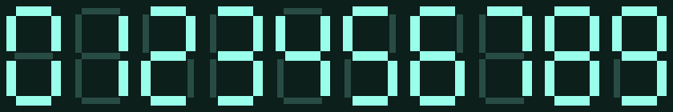
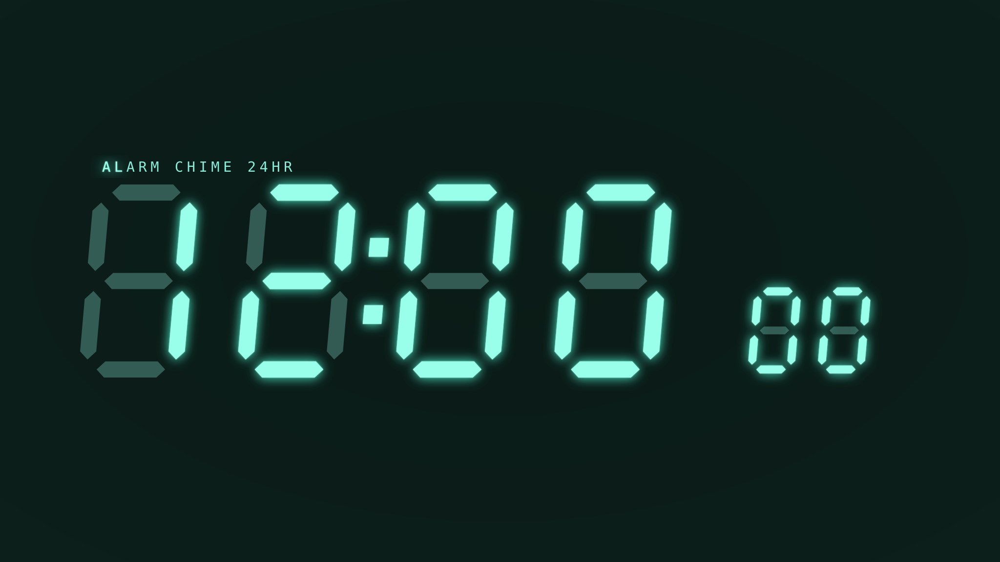
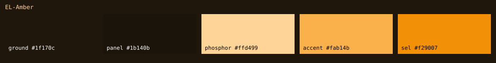
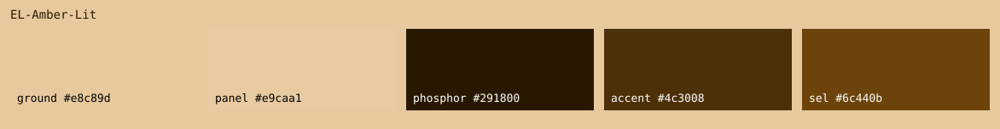
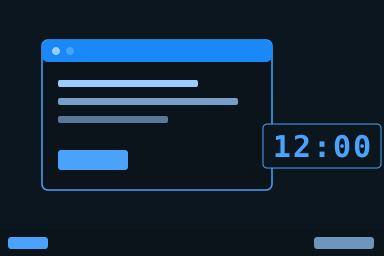
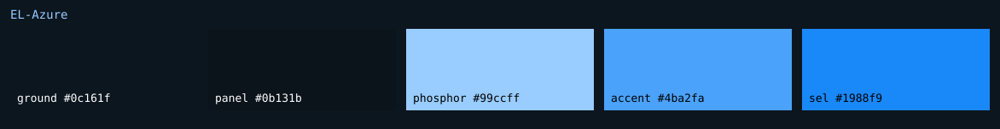
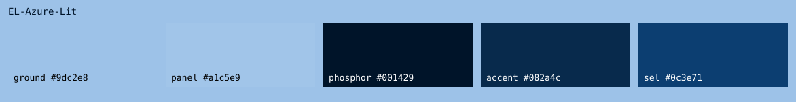
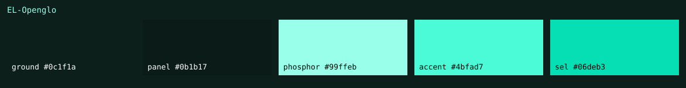
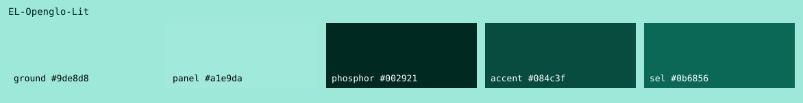

# EL Openglo — sample library

*Generated by `catalog/library/render_samples.py`. Do not hand-edit: a hand-maintained index outlives the files it names.*

## (all)

**splash-digits** — the boot splash's 0-9, rendered in PIL from the shared geometry

**wallpaper** — the desktop wallpaper — the clock face ⊕SEGMENT-SUBSTRATE rewires

## EL-Amber

**preview** — the scheme rendered as a mock desktop

**swatch** — the palette itself — every scheme token, labelled

## EL-Amber-Lit

**preview** — the scheme rendered as a mock desktop

**swatch** — the palette itself — every scheme token, labelled

## EL-Azure

**preview** — the scheme rendered as a mock desktop

**swatch** — the palette itself — every scheme token, labelled

## EL-Azure-Lit

**preview** — the scheme rendered as a mock desktop

**swatch** — the palette itself — every scheme token, labelled

## EL-Openglo

**preview** — the scheme rendered as a mock desktop

**swatch** — the palette itself — every scheme token, labelled

## EL-Openglo-Lit

**preview** — the scheme rendered as a mock desktop

**swatch** — the palette itself — every scheme token, labelled

