# Screens — every surface, every variant, through the theme

GENERATED by `catalog/library/render_screens.py`; do not edit. Each picture is the
emitted surface rendered by Qt under the KDE platform theme with that variant's
colour scheme applied in a private kdeglobals — what the desktop draws, not a mock-up.
`scripts/opa_gate.py screens` holds every still to exist, be non-blank and sit on its
variant's ground.

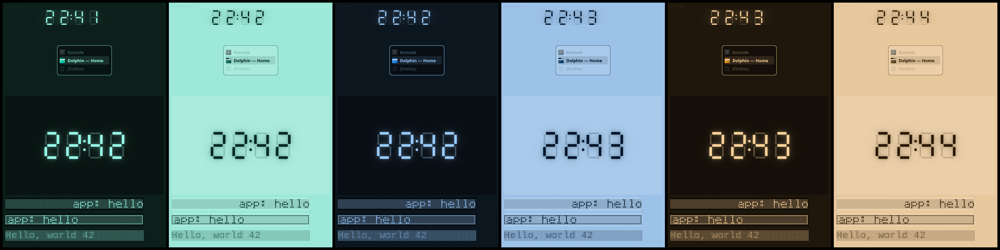

## EL-Openglo

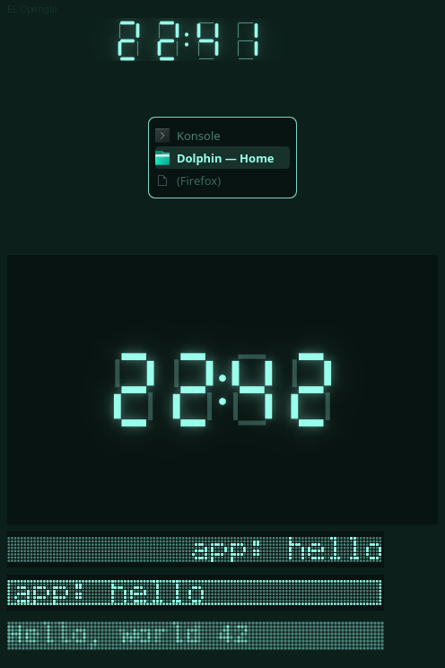

- `clock-EL-Openglo.png`
- `switcher-EL-Openglo.png`
- `live-wallpaper-EL-Openglo.png`
- `marquee-EL-Openglo.png`
- `marquee-paused-EL-Openglo.png`
- `pinholes-EL-Openglo.png`
- `marquee-anim-EL-Openglo.png` — APNG, the widget scrolling (S5: never tears)

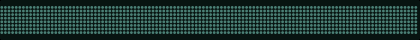

## EL-Openglo-Lit

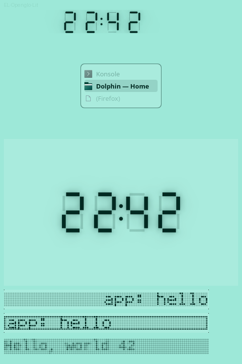

- `clock-EL-Openglo-Lit.png`
- `switcher-EL-Openglo-Lit.png`
- `live-wallpaper-EL-Openglo-Lit.png`
- `marquee-EL-Openglo-Lit.png`
- `marquee-paused-EL-Openglo-Lit.png`
- `pinholes-EL-Openglo-Lit.png`
- `marquee-anim-EL-Openglo-Lit.png` — APNG, the widget scrolling (S5: never tears)

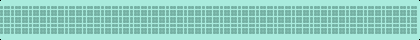

## EL-Azure

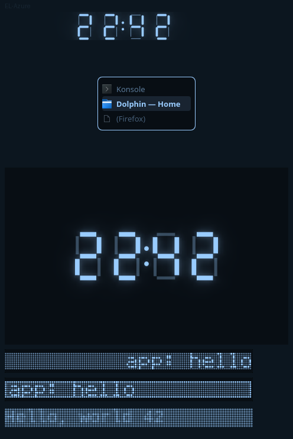

- `clock-EL-Azure.png`
- `switcher-EL-Azure.png`
- `live-wallpaper-EL-Azure.png`
- `marquee-EL-Azure.png`
- `marquee-paused-EL-Azure.png`
- `pinholes-EL-Azure.png`
- `marquee-anim-EL-Azure.png` — APNG, the widget scrolling (S5: never tears)

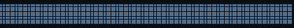

## EL-Azure-Lit

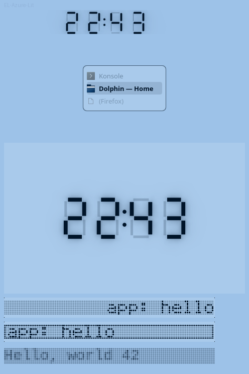

- `clock-EL-Azure-Lit.png`
- `switcher-EL-Azure-Lit.png`
- `live-wallpaper-EL-Azure-Lit.png`
- `marquee-EL-Azure-Lit.png`
- `marquee-paused-EL-Azure-Lit.png`
- `pinholes-EL-Azure-Lit.png`
- `marquee-anim-EL-Azure-Lit.png` — APNG, the widget scrolling (S5: never tears)

## EL-Amber

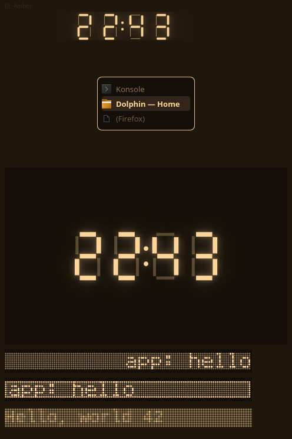

- `clock-EL-Amber.png`
- `switcher-EL-Amber.png`
- `live-wallpaper-EL-Amber.png`
- `marquee-EL-Amber.png`
- `marquee-paused-EL-Amber.png`
- `pinholes-EL-Amber.png`
- `marquee-anim-EL-Amber.png` — APNG, the widget scrolling (S5: never tears)

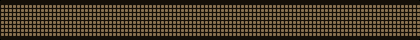

## EL-Amber-Lit

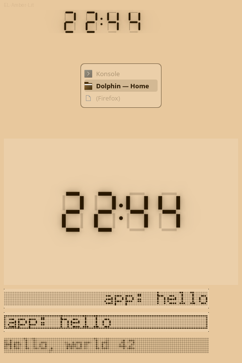

- `clock-EL-Amber-Lit.png`
- `switcher-EL-Amber-Lit.png`
- `live-wallpaper-EL-Amber-Lit.png`
- `marquee-EL-Amber-Lit.png`
- `marquee-paused-EL-Amber-Lit.png`
- `pinholes-EL-Amber-Lit.png`
- `marquee-anim-EL-Amber-Lit.png` — APNG, the widget scrolling (S5: never tears)

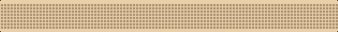
